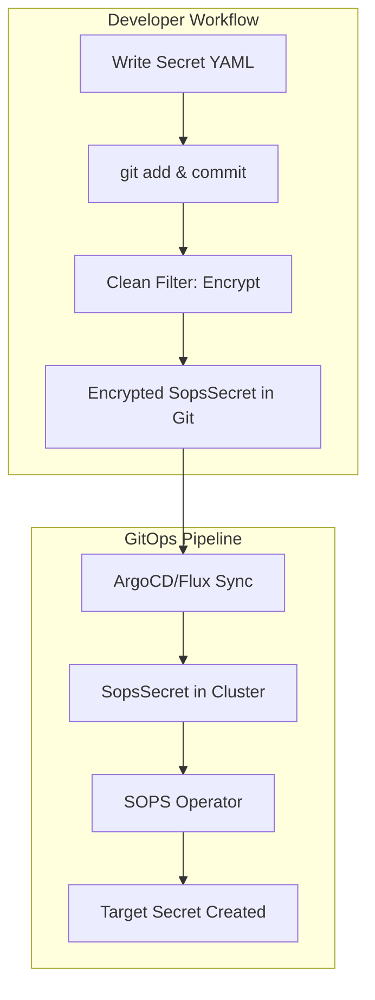

# Dead Simple Kubernetes Secret Management

I don't like managing secrets in Kubernetes.
Solutions like HashiCorp Vault are complicated and resource-intensive.
Kubeseal was actually great but now that Bitnami got aquired by Broadcom, I'm concerned 
about the future of the ```apiVersion: bitnami.com/``` API domain.

I wanted something **fully transparent**, so I can work with normal secrets in my repo, 
git commit, have the secrets provisioned on my k8s cluster and never have to care about 
encryption and secret management.

This repo boilerplate uses [**SOPS**](https://github.com/getsops/sops) (Secrets OPerationS), 
[**AGE**](https://github.com/FiloSottile/age) encryption and advanced 
[gitattributes filters](https://git-scm.com/docs/gitattributes#_filter) in order to 
provide a transparent workflow for developers to manage their secrets with the kubernetes 
[sops-secrets-operator](https://github.com/isindir/sops-secrets-operator).

## 🎯 What This Provides

- **🔒 Transparent Encryption**: Secrets are automatically encrypted when committed to Git
- **🔓 Transparent Decryption**: Encrypted secrets appear as readable YAML in your working directory
- **🎯 Selective Processing**: Only secrets with specific annotations are encrypted
- **🔄 GitOps Integration**: Full automation from Git commit to deployed Kubernetes secrets
- **✅ E2E Testing**: Comprehensive test suite to validate the entire workflow


## 🚀 Quick Start

1. **Prerequisites**: Install required tools:
   ```bash
   # Install Python PyYAML (required for Git filters)
   pip3 install PyYAML
   
   # Install SOPS
   curl -LO https://github.com/getsops/sops/releases/latest/download/sops-v3.9.1.linux.amd64
   sudo mv sops-v3.9.1.linux.amd64 /usr/local/bin/sops
   sudo chmod +x /usr/local/bin/sops
   
   # Install AGE (available on Fedora)
   sudo dnf install age

   # or from binary release
   # curl -LO https://github.com/FiloSottile/age/releases/latest/download/age-v1.1.1-linux-amd64.tar.gz
   # tar -xzf age-v1.1.1-linux-amd64.tar.gz && sudo mv age/age* /usr/local/bin/
   
   # Install Helm (for Kubernetes operator)
   curl https://raw.githubusercontent.com/helm/helm/main/scripts/get-helm-3 | bash
   ```

2. **Generate AGE key**:
   ```bash
   # Repository-local key (recommended for team projects)
   mkdir -p .age
   age-keygen -o .age/age.key
   echo ".age/" >> .gitignore  # Ensure private key is not committed
   
   # Get your public key (adjust path as needed)
   age-keygen -y .age/age.key
   ```
   
   **🔑 AGE Key Location Precedence**:
   1. **Environment variable**: `SOPS_AGE_KEY_FILE=/path/to/age.key` (highest precedence)
   2. **Repository-local**: `.age/age.key` (recommended for team projects)
   
   **⚠️ Important**: 
   - Keep your private key secure and backed up
   - Never commit your private key to Git (add `.age/` to .gitignore)
   - Share only the public key with team members

3. **Configure SOPS** with your AGE public key:
   ```bash
   cp .sops.yaml.template .sops.yaml
   # Replace YOUR_AGE_PUBLIC_KEY_HERE with your actual key
   ```

4. **Install Git filters**:
   ```bash
   # Make filter scripts executable
   chmod +x sops-clean.py sops-smudge.py
   
   # Configure Git filters for automatic encryption/decryption
   git config filter.sops.clean './sops-clean.py'
   git config filter.sops.smudge './sops-smudge.py'
   git config filter.sops.required true
   
   # Configure diff driver for better viewing of encrypted files
   git config diff.sops.textconv 'sops -d'
   ```

5. **Deploy SOPS Operator to Kubernetes**:
   ```bash
   # Add the SOPS operator Helm repository
   helm repo add sops https://isindir.github.io/sops-secrets-operator/
   helm repo update
   
   # Create namespace and AGE key secret
   kubectl create namespace sops-secrets-operator-system
   kubectl create secret generic sops-age-key \
     --from-file=age.key=~/.age/age.key \
     -n sops-secrets-operator-system
   
   # Install the SOPS operator via Helm
   helm install sops-secrets-operator sops/sops-secrets-operator \
     -n sops-secrets-operator-system \
     --set secretsAsEnvVars.SOPS_AGE_KEY_FILE=/etc/age-key/age.key
   
   # Verify deployment
   kubectl wait --for=condition=Available deployment/sops-secrets-operator \
     -n sops-secrets-operator-system --timeout=300s
   ```

6. **Create your first encrypted secret**:
   ```bash
   cp examples/basic-secret.yaml examples/my-app-secret.yaml
   # Edit examples/my-app-secret.yaml with your values, then commit
   git add examples/my-app-secret.yaml
   git commit -m "Add encrypted secret"
   ```

7. **Test everything works**:
   ```bash
   # Quick local filter testing
   ./run-e2e-tests.sh local
   
   # Full GitOps workflow testing (default)
   ./run-e2e-tests.sh full
   ```

## 🔄 How It Works



## 📚 Documentation

- **[Advanced Setup](./docs/advanced-setup.md)**: Advanced configuration and testing
- **[Usage Guide](./docs/usage.md)**: How to create and manage encrypted secrets
- **[Troubleshooting](./docs/troubleshooting.md)**: Common issues and solutions
- **[Security Guide](./docs/security.md)**: Best practices for key management

## 🧪 Testing

This boilerplate includes comprehensive E2E tests with two modes:

```bash
# Quick local testing (filters only)
./run-e2e-tests.sh local

# Complete GitOps workflow testing
./run-e2e-tests.sh full

# Show help and available options
./run-e2e-tests.sh --help
```

## 📄 License

MIT License - see [LICENSE](./LICENSE) for details.

## 🙏 Acknowledgments

- [SOPS](https://github.com/getsops/sops) - Secrets OPerationS by Mozilla
- [AGE](https://github.com/FiloSottile/age) - A simple, modern and secure encryption tool
- [SOPS Secrets Operator](https://github.com/isindir/sops-secrets-operator) - Kubernetes operator for SOPS
